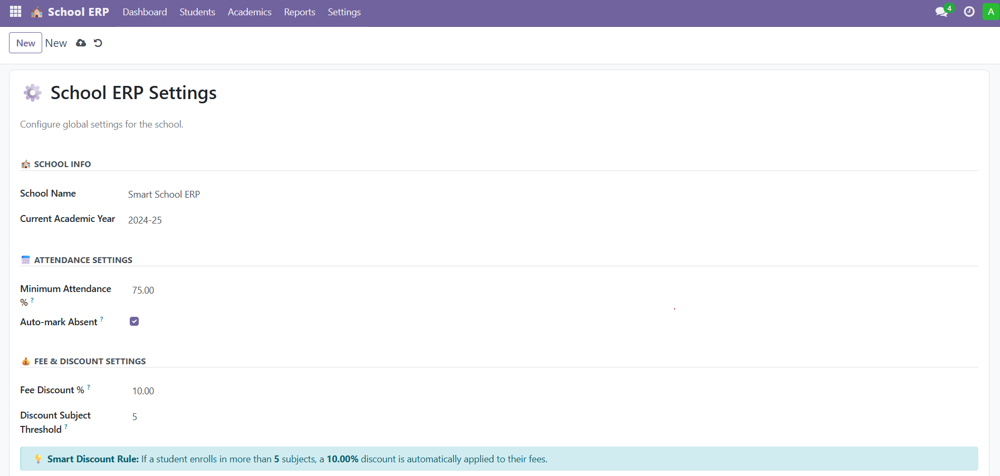
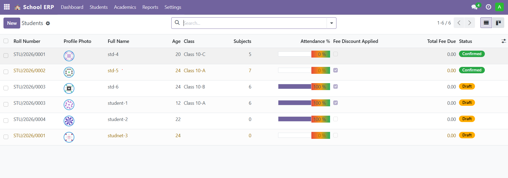
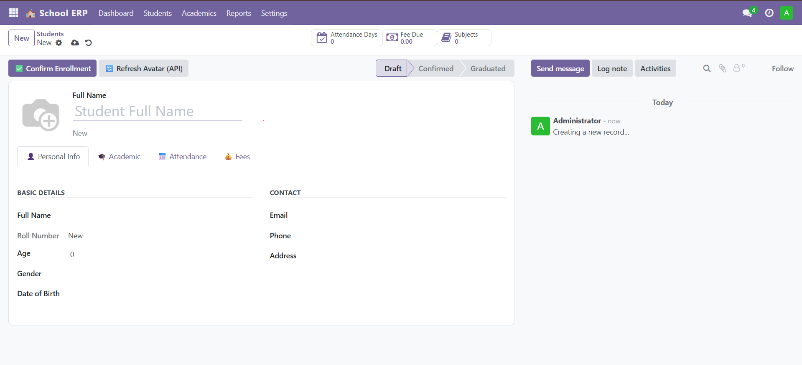
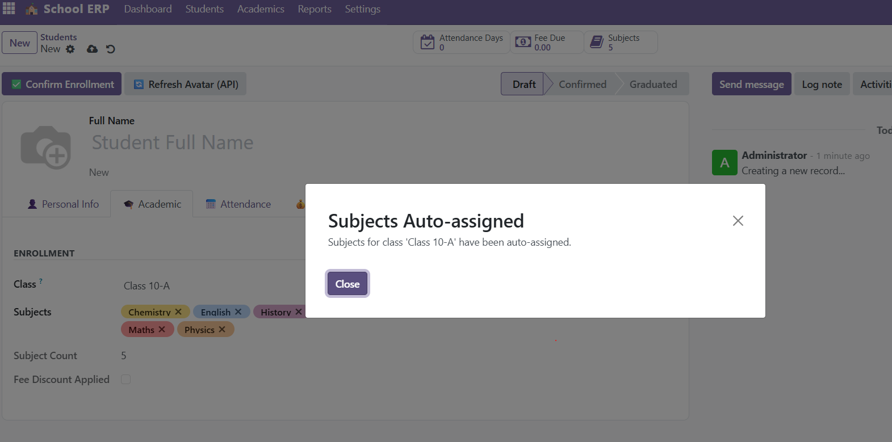
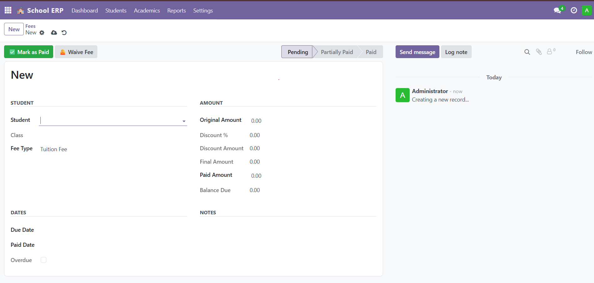

# 🏫 Smart School ERP — Odoo 17 Custom Module

A fully featured School Management System built as a custom Odoo 17 module.

## 🚀 Features

- Student lifecycle management (Draft → Confirmed → Graduated)
- Auto attendance tracking with computed statistics
- Smart fee discount (auto-applied when enrolled in 5+ subjects)
- External API integration (DummyJSON avatar API)
- Role-based security (Admin / Teacher / Student)
- QWeb PDF reports (Student Report Card, Attendance Report)
- Bulk attendance wizard
- Automated cron jobs (auto-mark absent, overdue fees)
- REST API endpoints for external access

## 🧠 Odoo Concepts Covered

| Concept          | Where used                               |
| ---------------- | ---------------------------------------- |
| Many2one         | student → class                          |
| Many2many        | student ↔ subject                        |
| One2many         | student → attendance records             |
| @api.depends     | attendance % auto-computed               |
| @api.onchange    | subjects auto-filled when class selected |
| @api.constrains  | age + DOB cross-validation               |
| Workflow (state) | Draft → Confirmed → Graduated            |
| TransientModel   | Bulk attendance wizard                   |
| ir.cron          | Auto-mark absent daily                   |
| QWeb Reports     | PDF student report card                  |
| HTTP Controller  | REST API endpoints                       |
| Security groups  | Admin / Teacher / Student roles          |

## 🔗 External API

Uses DummyJSON avatar API to auto-fetch profile photos
`https://dummyjson.com/icon/HASH/150?type=png`

## 🛠️ Tech Stack

- Odoo 17
- Python 3
- PostgreSQL
- Docker

## 📦 Installation

```bash
git clone https://github.com/soubankunnummel/school-ERP-odoo
cd smart-school-erp
docker-compose up -d
# Install module from Odoo Apps menu
```

## 📸 Screenshots

### Students List View



### Student Form — Personal Info



### Fee Management



### Subjects Auto-assigned on Class Selection



### School ERP Settings


